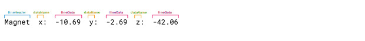

> made with [Processing](https://github.com/processing/processing),  [controlP5](https://github.com/sojamo/controlp5) (and [jnativehook](https://github.com/kwhat/jnativehook))


> :warning: **work in progress**

# Serial Plotter
for  debugging and logging


**features:**
- [x] manual scaling
- [x] auto scaling
- [x] regex filter for various data formats
- [x] recorder (save data to file)
- [ ] transmitter (send data to serial)
- [ ] toggling individual graphs
- [ ] set color for individual graphs
- ¿ reordering data sets ?
- ¿ tree view of regex filtering ?

**known issues:**
- order of datasets gets flipped 😠
- number of colors hard coded


## Docs

The Plotter parses Serial input as lines of strings.

Each line may have a "header" labeling the data in the line.
There may be more than one datum per line and data can consist of tuples of values (e.g. vectors). 
And each datum may have a "name" or label.

All of those can be filtered for by RegEx patterns.

### The Reg Ex Patterns Examples

**Patterns**:
```java
lineHeadPattern = "^\\w*";
dataNamePattern = "\\w+(?=:)";
lineDataPattern = "-?\\d+\\.?\\d+";
```

#### Data #1
```java
IMU1#OR:0.667,-0.258,-0.687,0.124
IMU2#OR:0.724,-0.115,0.259,0.629
IMU3#OR:0.772,0.356,-0.176,-0.497
IMU4#OR:0.686,0.397,-0.422,-0.440
```
```java
IMU_RAW#GY:0.070,0.070,-0.070#AC:0.032,0.028,0.971#MG:-0.083020,-0.599340,-0.779800
```
**Results**:


#### Data #2:
```java
Accel  x:  0.11  y:  -0.03  z:  -0.06
Magnet  x:  -10.69  y:  -2.69  z:  -42.06
Temp  C:  25
Gravity  x:  -0.22  y:  1.06  z:  9.74
Quat  w:  -0.7639  x:  -0.0488  y:  0.0263  z:  0.6429
```
**Results**:



<!-- Regex Filtering Tree View
**Expected Result**:
```js
[
    {
       "lineHead":"IMU1",
       "lineData":[
          {
             "name":"OR",
             "values":[ 0.667, 0.258, -0.687, 0.124 ]
          }
       ]
    },
    {
       "lineHead":"IMU2",
       "lineData":[
          {
             "name":"OR",
             "values":[ 0.724, 0.115, 0.259, 0.629 ]
          }
       ]
    },
    {
       "lineHead":"IMU3",
       "lineData":[
          {
             "name":"OR",
             "values":[ 0.772, 0.356, -0.176, -0.497 ]
          }
       ]
    },
    {
       "lineHead":"IMU4",
       "lineData":[
          {
             "name":"OR",
             "values":[ 0.686, 0.397, -0.422, -0.440 ]
          }
       ]
    }
]
```
```js
[
    {
       "lineHead":"IMU_RAW",
       "lineData":[
          {
             "name":"GY",
             "values":[ 0.070, 0.070, -0.070 ]
          },
          {
             "name":"AC",
             "values":[ 0.032, 0.028, 0.971 ]
          },
          {
             "name":"MG",
             "values":[ 0.083020, 0.599340, -0.779800 ]
          }
       ]
    }
 ]
```

```js
[
    {
       "lineHead":"Accel",
       "lineData":[
          {
             "name":"x",
             "values":[ 0.11 ]
          },
          {
             "name":"y",
             "values":[ 0.03 ]
          },
          {
             "name":"z",
             "values":[ 0.06 ]
          }
       ]
    },
    {
       "lineHead":"Magnet",
       "lineData":[
          {
             "name":"x",
             "values":[ 10.69 ]
          },
          {
             "name":"y",
             "values":[ 2.69 ]
          },
          {
             "name":"z",
             "values":[ 42.06 ]
          }
       ]
    },
    {
       "lineHead":"Temp",
       "lineData":[
          {
             "name":"C",
             "values":[ 25 ]
          }
       ]
    },
    {
       "lineHead":"Gravity",
       "lineData":[
          {
             "name":"x",
             "values":[ 0.22 ]
          },
          {
             "name":"y",
             "values":[ 1.06 ]
          },
          {
             "name":"z",
             "values":[ 9.74 ]
          }
       ]
    },
    {
       "lineHead":"Quat",
       "lineData":[
          {
             "name":"w",
             "values":[ 0.7639 ]
          },
          {
             "name":"x",
             "values":[ 0.0488 ]
          },
          {
             "name":"y",
             "values":[ 0.0263 ]
          },
          {
             "name":"z",
             "values":[ 0.6429 ]
          }
       ]
    }
 ]
```
-->